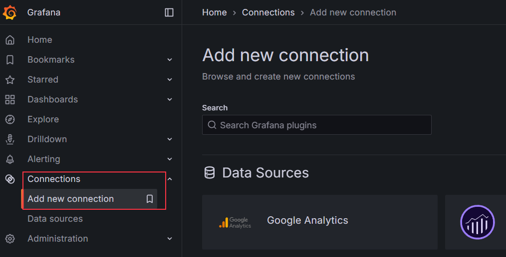
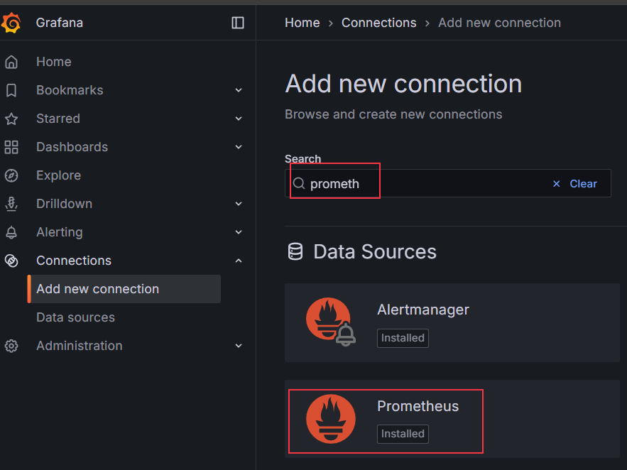
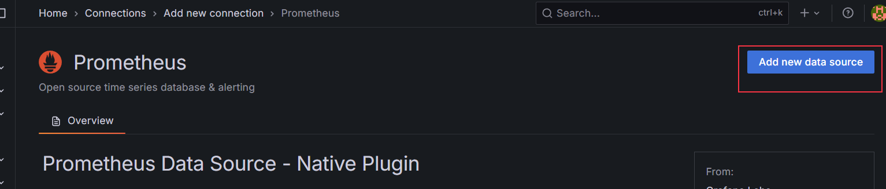
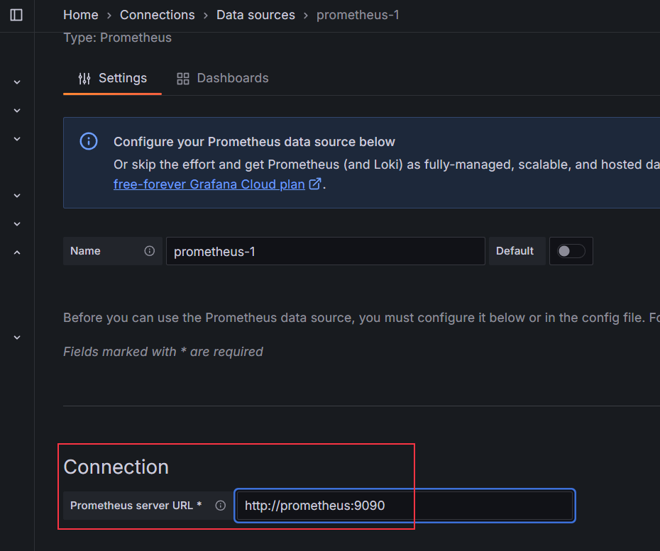
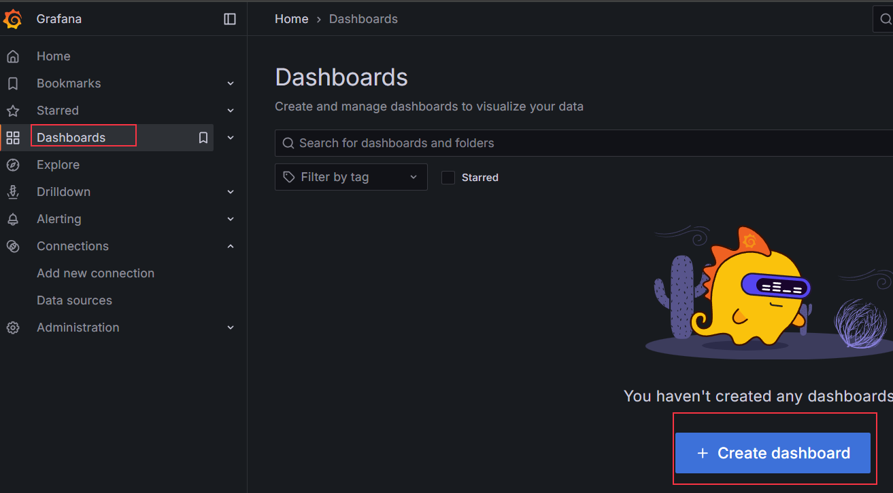
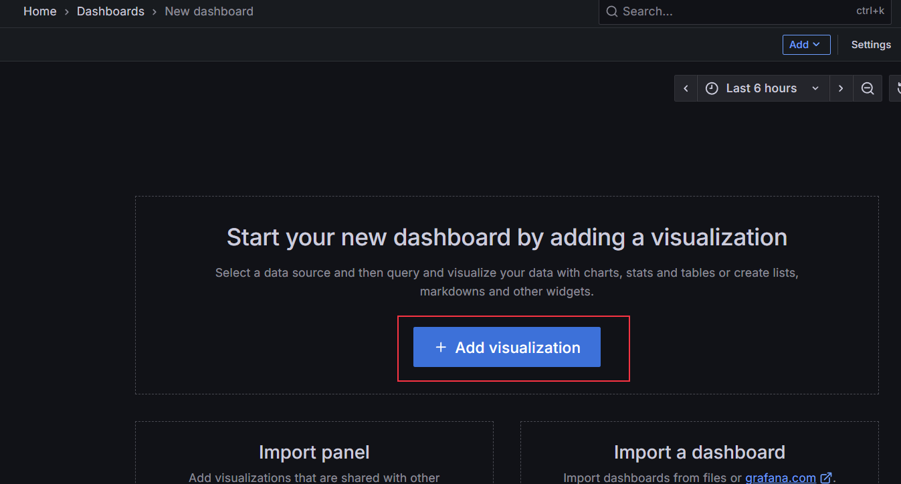
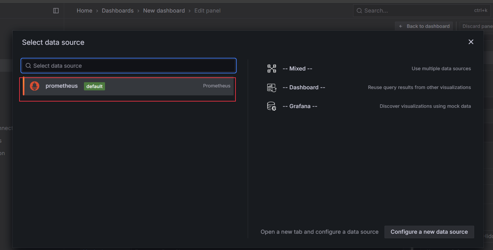
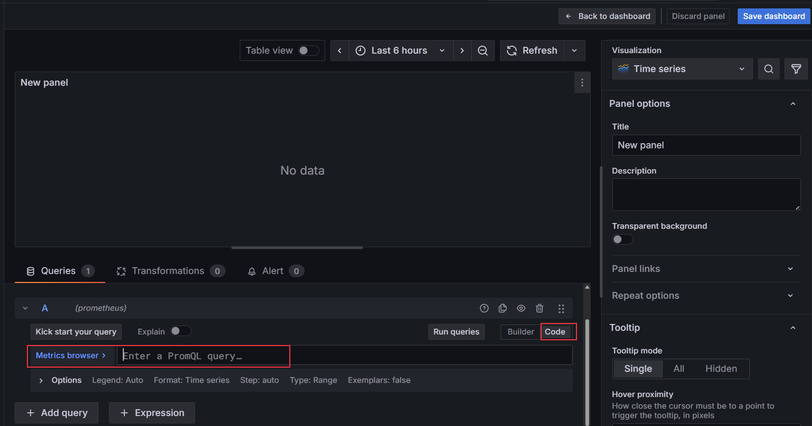
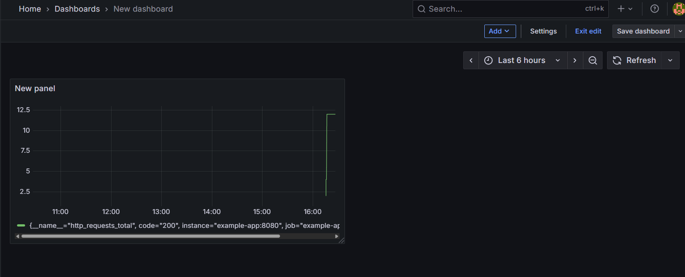

# Prometheus 體驗

今天來體驗 Prometheus ，是一個監控系統加排序資料庫(Time-series DB)，主要用於監控主機跟服務的性能。

## 安裝 

- 安裝一樣透過docker來實現，搭配docker-compose，主打一個高效方便

```sh
# 預期的資料結構
C:\USERS\ASUS\STEVEN\PROMETHEUS
│  docker-compose.yml
│
└─prometheus
        prometheus.yml
```

- `docker-compose.yml`

```docker
version: "3.9"

services:
  prometheus:
    image: prom/prometheus:latest
    container_name: prometheus
    ports:
      - "9090:9090"          # Prometheus UI
    volumes:
      - ./prometheus/prometheus.yml:/etc/prometheus/prometheus.yml:ro
    command: ["--config.file=/etc/prometheus/prometheus.yml"]

  example-app:
    image: quay.io/brancz/prometheus-example-app:v0.3.0
    container_name: prom-example
    ports:
      - "8080:8080"          # 範例應用的 /metrics
    environment:
      - HTTP_LISTEN_ADDRESS=:8080
      # 這個 app 會自動在 /metrics 暴露 counter/gauge/histogram

  grafana:
    image: grafana/grafana:latest
    container_name: grafana
    ports:
      - "3000:3000"          # Grafana UI (帳密 admin/admin)
    environment:
      - GF_SECURITY_ADMIN_USER=admin
      - GF_SECURITY_ADMIN_PASSWORD=admin
    volumes:
      - grafana-data:/var/lib/grafana

volumes:
  grafana-data:
```

- prometheus/prometheus.yml

```docker
global:
  scrape_interval: 5s
  evaluation_interval: 15s

scrape_configs:
  - job_name: "example-app"
    static_configs:
      - targets: ["example-app:8080"]   # 由 compose DNS 解析到容器

```

- 啟動 prometheus

```sh
docker-compose up -d
```

## Grafana

- grafana是prometheus的一個UI，幫助我們看到prometheus收集到的數據最終被視覺化的地方。
- 前面的 `docker-compose` 順利執行後，[grafana-ui](http://localhost:3000) 直接按這個就能打開網站了

### 監控數據

進到了 grafana 裡面後，我們就來監控一下剛剛docker-compose中有順帶起的一個prometheus的範例容器，好幫助我們來熟悉如何去監控我們的應用

1. 點擊Grafana 左側的`Connections`，再選擇`Add new connection`



2. 搜尋 prometheus，點下去，再按下`Add new data source`




3. 再Connection中填入 http://prometheus:9090 ，再按 `Save & Test`



4. 點擊Grafana 左側的`Dashboards`，再選擇`Create dashboard`



5. 按下`Add visualization`，data source選擇`prometheus`，第3步存的




6. 在下面Queries的部分，按`Code`的地方，輸入`http_requests_total`，按`Save dashboard`，再按`Back to dashboard`
7. 執行 http://localhost:8080/ 幾次，讓prometheus去讀取metrics，之後就能在dashboard上看到相關的數據了




## 明日接續

今天先簡單體驗一下prometheus到一個範例監控的小場景，明天來搭配之前的C++ grpc server做相關的監控。
