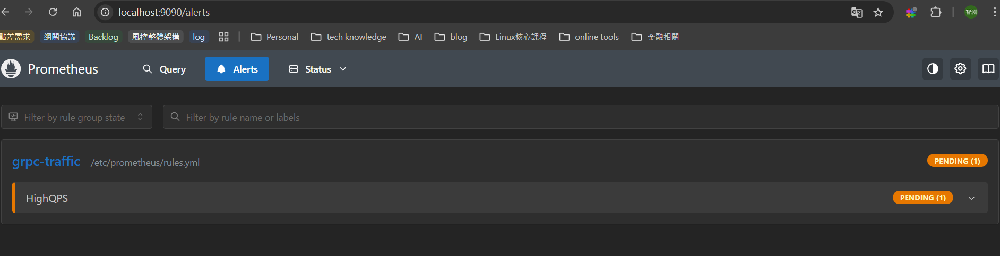
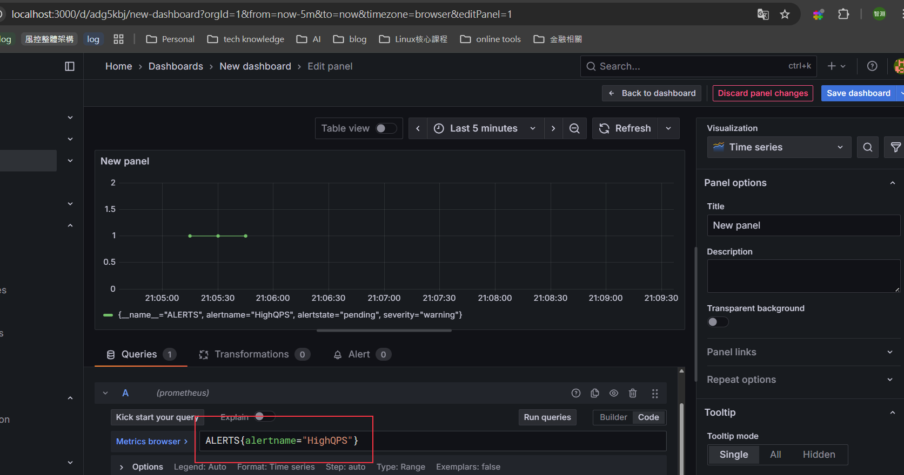

# Prometheus 體驗 2

今天來延伸一下，就使用之前的C++ grpc專案來監控，並搭配上prometheus的告警功能

## 環境準備

這邊延續`day13`使用到的C++ grpc的環境，`grpc-cpp`跟之前的是一致的

```sh
# 預期的目錄結構
C:\USERS\ASUS\STEVEN\CPP-PROMETHEUS
│  docker-compose.yml
│
├─alertmanager
│      alertmanager.yml
│
├─grpc-cpp
│  │  CMakeLists.txt
│  │
│  ├─proto
│  │      helloworld.proto
│  │
│  └─src
│          client.cpp
│          server.cpp
│
└─prometheus
        prometheus.yml
        rules.yml
```

- docker-compose.yml

```docker
version: "3.9"
services:
  cpp_grpc:
    image: grpc_coredns_consul_cpp_grpc          # day13的容器
    container_name: cpp_grpc
    networks: [mesh]
    working_dir: /root/grpc-cpp
    volumes:
      - /c/Users/Asus/steven/cpp-prometheus/grpc-cpp:/root/grpc-cpp
    tty: true

  prometheus:
    image: prom/prometheus:latest
    container_name: prometheus
    networks: [mesh]
    ports: ["9090:9090"]
    volumes:
      - ./prometheus/prometheus.yml:/etc/prometheus/prometheus.yml:ro
      - ./prometheus/rules.yml:/etc/prometheus/rules.yml:ro
    command:
      - "--config.file=/etc/prometheus/prometheus.yml"
      - "--web.enable-lifecycle"    # 允許熱重載 /-/reload（可選）

  alertmanager:
    image: prom/alertmanager:latest
    container_name: alertmanager
    networks: [mesh]
    ports: ["9093:9093"]
    volumes:
      - ./alertmanager/alertmanager.yml:/etc/alertmanager/alertmanager.yml:ro

  grafana:
    image: grafana/grafana:latest
    container_name: grafana
    networks: [mesh]
    ports: ["3000:3000"]
    environment:
      - GF_SECURITY_ADMIN_USER=admin
      - GF_SECURITY_ADMIN_PASSWORD=admin
    volumes:
      - grafana-data:/var/lib/grafana

networks:
  mesh:
    driver: bridge

volumes:
  grafana-data:

```

- alertmanager/alertmanager.yml

```yml
route:
  receiver: "default"
  group_by: ["alertname"]

receivers:
- name: "default"
  # 不配置外部通知，先在 UI 9093 看
```

- prometheus/prometheus.yml

```yml
global:
  scrape_interval: 5s
  evaluation_interval: 5s

alerting:
  alertmanagers:
    - static_configs:
        - targets: ["alertmanager:9093"]

rule_files:
  - /etc/prometheus/rules.yml

scrape_configs:
  - job_name: "grpc_server"
    static_configs:
      - targets: ["cpp_grpc:8080"]  # 你的 server /metrics

```

- prometheus/rules.yml

```yml
groups:
- name: grpc-traffic
  rules:
  - alert: HighQPS
    expr: sum(rate(grpc_requests_total[1m])) > 0     # 先用大於0來快速觸發
    for: 1m
    labels:
      severity: warning
    annotations:
      summary: "High request rate"
      description: "grpc_requests_total 1m rate is above 100 req/s (current: {{ $value }})"

```

- 啟動

```sh
docker-compose up -d
```

## Prometheus SDK

- 前面啟動完了之後，我們就一樣進到cpp_grpc的容器裡面進行編譯與運行
- 安裝 Prometheus SDK

```sh
vcpkg install prometheus-cpp
```

- `CMakelists.txt` 調整一下，在最後面補上下面兩段

```cmake
find_package(prometheus-cpp CONFIG REQUIRED)
target_link_libraries(server PRIVATE prometheus-cpp::core prometheus-cpp::pull prometheus-cpp::util)
```

- 加上metrics 相關的代碼，會開一個 /metrics http，讓prometheus來接收相關資訊

```cpp
// metrics.h
#pragma once
#include <prometheus/exposer.h>
#include <prometheus/registry.h>
#include <prometheus/counter.h>
#include <prometheus/histogram.h>
#include <memory>

struct Metrics {
  std::shared_ptr<prometheus::Registry> registry{std::make_shared<prometheus::Registry>()};
  prometheus::Counter* req_total{};
  prometheus::Histogram* req_latency_ms{};
  std::unique_ptr<prometheus::Exposer> exposer;

  explicit Metrics(const std::string& bind_addr)
      : exposer(std::make_unique<prometheus::Exposer>(bind_addr)) {
    exposer->RegisterCollectable(registry);

    auto& cfam = prometheus::BuildCounter()
                   .Name("grpc_requests_total")
                   .Help("Total gRPC requests")
                   .Register(*registry);
    req_total = &cfam.Add({{"service", "greeter"}});

    auto& hfam = prometheus::BuildHistogram()
                   .Name("grpc_request_latency_ms")
                   .Help("Request latency (ms)")
                   .Register(*registry);
    req_latency_ms = &hfam.Add({{"service", "greeter"}},
      prometheus::Histogram::BucketBoundaries{1,2,5,10,20,50,100,200,500,1000});
  }
};

```

```cpp
// main.cpp
#include <grpcpp/grpcpp.h>
#include <iostream>
#include <memory>
#include <string>
#include <chrono>

// 產生的標頭
#include "helloworld.grpc.pb.h"
#include "helloworld.pb.h"

#include "metrics.h"

using grpc::Server;
using grpc::ServerBuilder;
using grpc::ServerContext;
using grpc::Status;

using demo::Greeter;
using demo::HelloReply;
using demo::HelloRequest;

class GreeterServiceImpl final : public Greeter::Service {
public:
  explicit GreeterServiceImpl(Metrics& metrics) : metrics_(metrics) {}

  Status SayHello(ServerContext* context,
                  const HelloRequest* request,
                  HelloReply* reply) override {
    (void)context;
    auto t0 = std::chrono::steady_clock::now();

    std::string msg = "Hello, " + request->name();
    reply->set_message(msg);
    std::cout << "[server] SayHello -> " << msg << std::endl;

    // 計數 + 觀測延遲
    metrics_.req_total->Increment();
    auto t1 = std::chrono::steady_clock::now();
    double ms = std::chrono::duration<double, std::milli>(t1 - t0).count();
    metrics_.req_latency_ms->Observe(ms);

    return Status::OK;
  }

private:
  Metrics& metrics_;
};

int main(int argc, char** argv) {
  std::string addr = "0.0.0.0:50051";
  if (argc > 1) addr = argv[1];

  // 啟動 /metrics
  Metrics metrics{"0.0.0.0:8080"};  // http://<host>:8080/metrics

  GreeterServiceImpl service(metrics);

  ServerBuilder builder;
  builder.AddListeningPort(addr, grpc::InsecureServerCredentials());
  builder.RegisterService(&service);
  std::unique_ptr<Server> server(builder.BuildAndStart());

  std::cout << "gRPC server listening on " << addr << std::endl;
  std::cout << "Metrics exposed at http://0.0.0.0:8080/metrics" << std::endl;

  server->Wait();
  return 0;
}
```

- 編譯與運行

```sh
# 這邊要補上一下vcpkg的位置
cmake -B [build directory] -S . -DCMAKE_TOOLCHAIN_FILE=[path to vcpkg]/scripts/buildsystems/vcpkg.cmake 
cd build
make

./server
```

## Grafana

服務器起好了之後，先開瀏覽器看看[grafana-ui](http://localhost:3000)

- 測試告警

```sh
# 回去剛剛的grpc-cpp 容器裡面，執行client
./client 127.0.0.1:50051 Alice
```

- 觀察結果，可以從[Prometheus UI alert](http://localhost:9090/alerts)上面看到rules狀態變成pending



- 若要簡單看觸發的歷史告警，也可以透過去grafana建data source，然後再建一個dash board，Query的PromQL使用`ALERTS{alertname="HighQPS"}`



## 結論

這次快速的體驗prometheus就到此告一段了。
