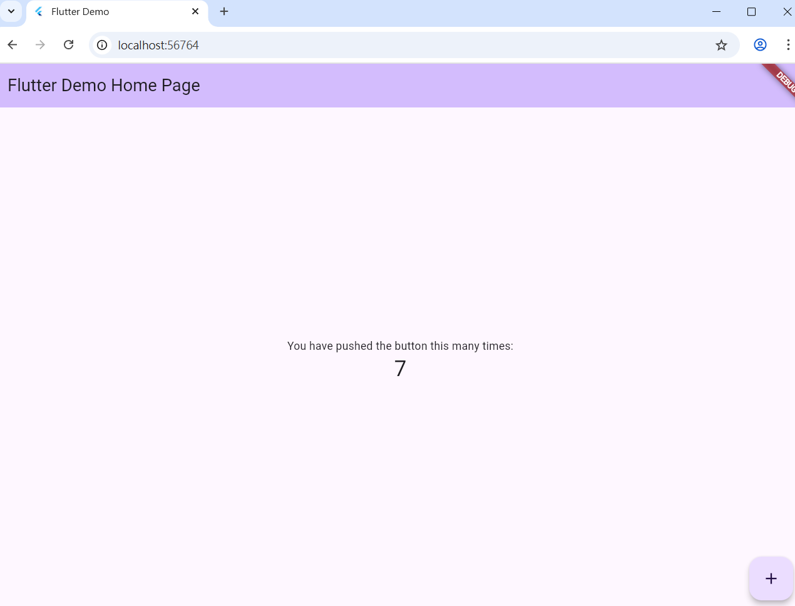
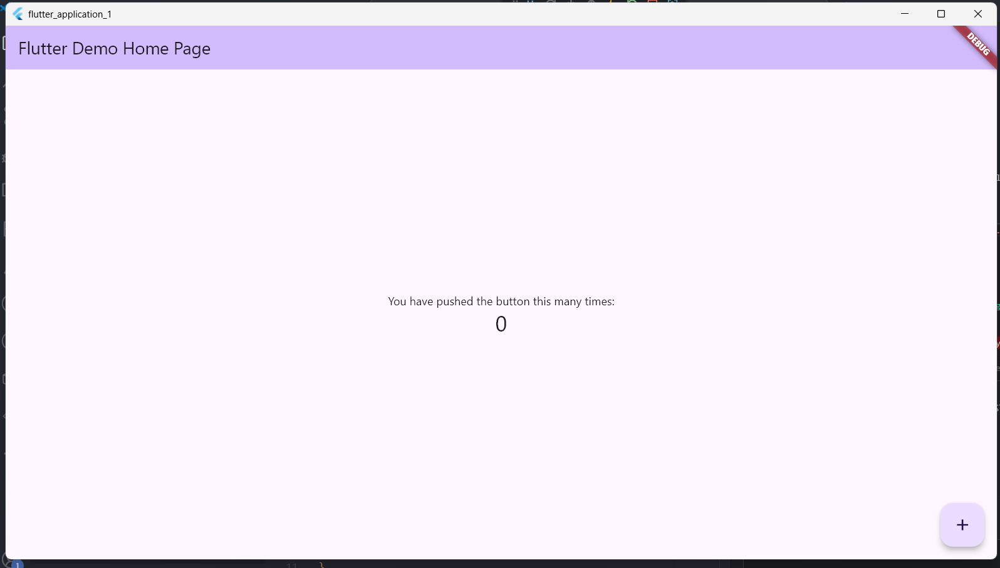

# App 開發體驗

今天來進行 App 開發的體驗，這邊的App指的是 mobile 上面的應用程式，起因是看了一些工程師會自己透過想法或創意在手機上就開始行動，有些甚至做出一番事業，讓我思考興趣跟工作兼容的可能性，以及身為一個懶人，若我能透過手機上的應用幫助自己生活上的一些小事，這些小事不需要透過別的App，因為通常這些提供功能的App都會透過訂閱或一些付費的方式能提供服務，本著免費仔的心態，想說自己來開發，之後也能開源回饋出去。

## 目標

- 目前App開發的框架很多，但自己做了一番研究後，打算分別體驗下面兩個框架
  - flutter
  - Qt framework
- 目前 AI 的強大，所以我打算用claude或codex主導開發，順路體驗一回 vibe coding
- 因為本人沒mac，所以ios 相關的應用這次先不考慮

## 今日目標

在windows上安裝flutter以及開發行動app需要的工具，並成功跑起專案。

## 環境準備

- 安裝 [android studio](https://developer.android.com/studio?hl=zh-tw)
- 安裝 [git](https://git-scm.com/downloads)
- 安裝 [vs code](https://code.visualstudio.com/)

## Flutter 安裝

[flutter官方文件](https://docs.flutter.dev/get-started/quick) 建議我們透過vscode 來安裝 flutter SDK

1. 打開 VS Code ，並選擇左側的 Extensions，尋找 `flutter` ，理論上第一個由Dart Code提供的就是官方提供的，這個Extension會幫我們裝 `flutter`跟`Dart`(flutter使用的語言)
2. 安裝好了，按 `CTRL + SHIFT + P` 輸入 `flutter` ，選擇 `Flutter: New Project`，VS Code 會發現我們沒裝 Flutter SDK，這時候就能讓VS Code 幫我們安裝

## 創建 Flutter 應用

1. 安裝完 `flutter` 之後，再次按 `CTRL + SHIFT + P` 輸入 `flutter`，選擇 `Flutter: New Project` ，再選擇 `Application`，建立一個新應用

## 運行 Flutter 應用

這邊就跟著官方的指示，先從網站應用做運行

1. 按 `CTRL + SHIFT + P` 輸入 `flutter`，選擇 `Flutter: Select Device`，選擇 `Chrome`
2. 按下 `F5` 來運行專案，等一陣子應該就會看到下面的畫面

- 如果我們要換成 `windows app`，一樣可以透過從選 `Flutter: Select Device`，再按 `F5` 來運行專案

## 結論

今天就先以成功運行一個flutter應用，並搭配兩個不同device的方式來演示作為今日的體驗，明天就開始透過使用AI tool來開發小專案。
