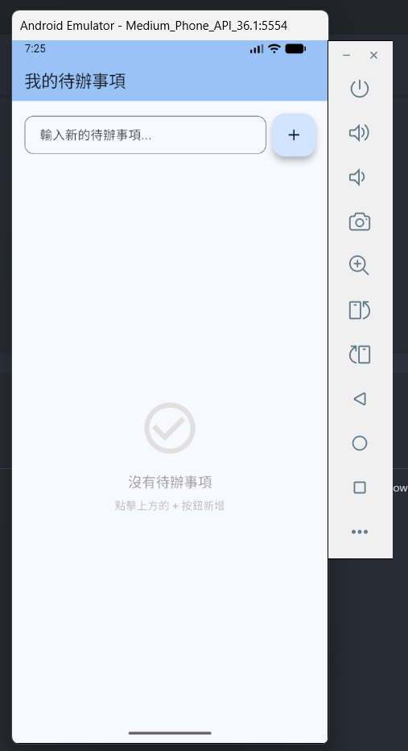

# App 開發體驗 2 - flutter 體驗

在昨天體驗完跑起官方提供的預設專案後，今天就是接著透過AI Tool幫我們開發其他專案。

## 今日目標

透過AI Tool協助開發 flutter 行動應用，一個簡單的TODO LIST小程序，並運行android 模擬器上面。

## TODO LIST小程序

這邊我是使用 VS Code 中的Extension `Claude Code for VS Code`，並且我有訂閱 Claude 的 `pro plan`，200 美金一年。

```dart
// main.dart
import 'package:flutter/material.dart';

void main() {
  runApp(const MyApp());
}

class MyApp extends StatelessWidget {
  const MyApp({super.key});

  @override
  Widget build(BuildContext context) {
    return MaterialApp(
      title: 'TODO List',
      debugShowCheckedModeBanner: false,
      theme: ThemeData(
        colorScheme: ColorScheme.fromSeed(seedColor: Colors.blue),
        useMaterial3: true,
      ),
      home: const TodoListPage(),
    );
  }
}

class TodoItem {
  String title;
  bool isCompleted;

  TodoItem({required this.title, this.isCompleted = false});
}

class TodoListPage extends StatefulWidget {
  const TodoListPage({super.key});

  @override
  State<TodoListPage> createState() => _TodoListPageState();
}

class _TodoListPageState extends State<TodoListPage> {
  final List<TodoItem> _todos = [];
  final TextEditingController _textController = TextEditingController();

  void _addTodo() {
    if (_textController.text.trim().isEmpty) return;

    setState(() {
      _todos.add(TodoItem(title: _textController.text.trim()));
      _textController.clear();
    });
  }

  void _toggleTodo(int index) {
    setState(() {
      _todos[index].isCompleted = !_todos[index].isCompleted;
    });
  }

  void _deleteTodo(int index) {
    setState(() {
      _todos.removeAt(index);
    });
  }

  @override
  void dispose() {
    _textController.dispose();
    super.dispose();
  }

  @override
  Widget build(BuildContext context) {
    int completedCount = _todos.where((todo) => todo.isCompleted).length;

    return Scaffold(
      appBar: AppBar(
        backgroundColor: Theme.of(context).colorScheme.inversePrimary,
        title: const Text('我的待辦事項'),
        elevation: 2,
      ),
      body: Column(
        children: [
          // 統計區域
          if (_todos.isNotEmpty)
            Container(
              padding: const EdgeInsets.all(16),
              color: Colors.blue.shade50,
              child: Row(
                mainAxisAlignment: MainAxisAlignment.spaceAround,
                children: [
                  _buildStatItem('總計', _todos.length.toString(), Colors.blue),
                  _buildStatItem('已完成', completedCount.toString(), Colors.green),
                  _buildStatItem('未完成', (_todos.length - completedCount).toString(), Colors.orange),
                ],
              ),
            ),

          // 輸入區域
          Padding(
            padding: const EdgeInsets.all(16.0),
            child: Row(
              children: [
                Expanded(
                  child: TextField(
                    controller: _textController,
                    decoration: InputDecoration(
                      hintText: '輸入新的待辦事項...',
                      border: OutlineInputBorder(
                        borderRadius: BorderRadius.circular(12),
                      ),
                      contentPadding: const EdgeInsets.symmetric(horizontal: 16, vertical: 12),
                    ),
                    onSubmitted: (_) => _addTodo(),
                  ),
                ),
                const SizedBox(width: 8),
                FloatingActionButton(
                  onPressed: _addTodo,
                  child: const Icon(Icons.add),
                ),
              ],
            ),
          ),

          // 待辦事項列表
          Expanded(
            child: _todos.isEmpty
                ? Center(
                    child: Column(
                      mainAxisAlignment: MainAxisAlignment.center,
                      children: [
                        Icon(Icons.check_circle_outline, size: 80, color: Colors.grey.shade300),
                        const SizedBox(height: 16),
                        Text(
                          '沒有待辦事項',
                          style: TextStyle(fontSize: 18, color: Colors.grey.shade500),
                        ),
                        const SizedBox(height: 8),
                        Text(
                          '點擊上方的 + 按鈕新增',
                          style: TextStyle(fontSize: 14, color: Colors.grey.shade400),
                        ),
                      ],
                    ),
                  )
                : ListView.builder(
                    itemCount: _todos.length,
                    padding: const EdgeInsets.symmetric(horizontal: 16),
                    itemBuilder: (context, index) {
                      final todo = _todos[index];
                      return Dismissible(
                        key: Key(todo.title + index.toString()),
                        background: Container(
                          margin: const EdgeInsets.symmetric(vertical: 4),
                          decoration: BoxDecoration(
                            color: Colors.red,
                            borderRadius: BorderRadius.circular(12),
                          ),
                          alignment: Alignment.centerRight,
                          padding: const EdgeInsets.only(right: 20),
                          child: const Icon(Icons.delete, color: Colors.white),
                        ),
                        direction: DismissDirection.endToStart,
                        onDismissed: (_) => _deleteTodo(index),
                        child: Card(
                          elevation: 2,
                          margin: const EdgeInsets.symmetric(vertical: 4),
                          shape: RoundedRectangleBorder(
                            borderRadius: BorderRadius.circular(12),
                          ),
                          child: ListTile(
                            leading: Checkbox(
                              value: todo.isCompleted,
                              onChanged: (_) => _toggleTodo(index),
                              shape: const CircleBorder(),
                            ),
                            title: Text(
                              todo.title,
                              style: TextStyle(
                                decoration: todo.isCompleted
                                    ? TextDecoration.lineThrough
                                    : TextDecoration.none,
                                color: todo.isCompleted
                                    ? Colors.grey
                                    : Colors.black,
                                fontSize: 16,
                              ),
                            ),
                            trailing: IconButton(
                              icon: const Icon(Icons.delete_outline, color: Colors.red),
                              onPressed: () => _deleteTodo(index),
                            ),
                          ),
                        ),
                      );
                    },
                  ),
          ),
        ],
      ),
    );
  }

  Widget _buildStatItem(String label, String value, Color color) {
    return Column(
      children: [
        Text(
          value,
          style: TextStyle(
            fontSize: 24,
            fontWeight: FontWeight.bold,
            color: color,
          ),
        ),
        Text(
          label,
          style: TextStyle(
            fontSize: 14,
            color: Colors.grey.shade600,
          ),
        ),
      ],
    );
  }
}

```

- 編譯與運行，一樣透過 `F5`，來讓專案運行起來

## 運行在 android 模擬器上

android 模擬器理論上在我們昨天裝完 `android studio` 之後應該就會裝在我們的電腦上

- 確認是否有 android 模擬器，在 VS Code 中按 `CTRL + ~` 打開一個cmd視窗輸入下面的指令，理論上應該會看到至少一個模擬器

```sh
flutter emulators
```

- 設定 flutter啟動使用此模擬器，一樣透過下面指令

```sh
flutter emulators --launch Medium_Phone_API_36.1
```

- 運行 flutter 專案，就能看到android 模擬器進入flutter TODO LIST的小程序了 (這一段第一次運行應該會持續10分種以上，放給他跑就對了)

```sh
flutter run
```



- 如果我們要關閉小程序，可以透過在cmd視窗輸入 `q`，來關閉 flutter 應用

## 結論

本次的 flutter 體驗就先到這邊告一段落，明日接續 qt framework的部分。
