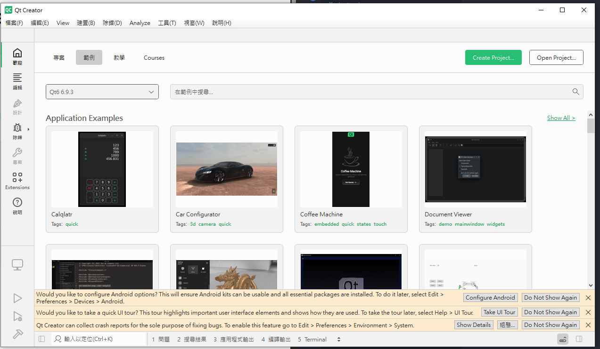
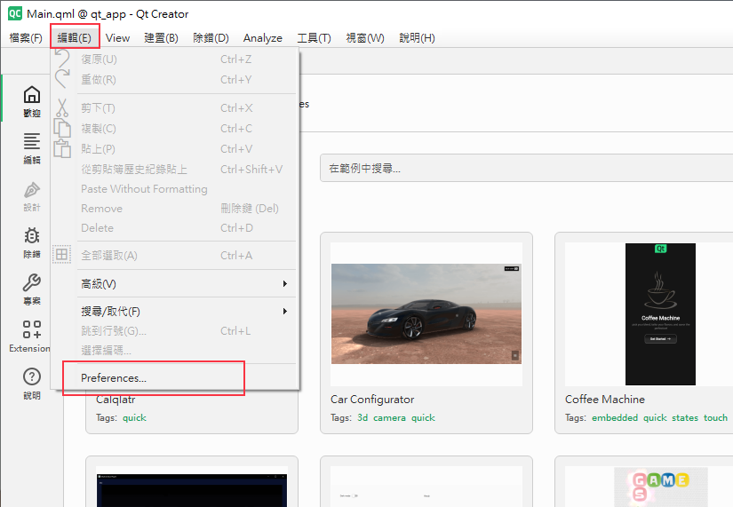
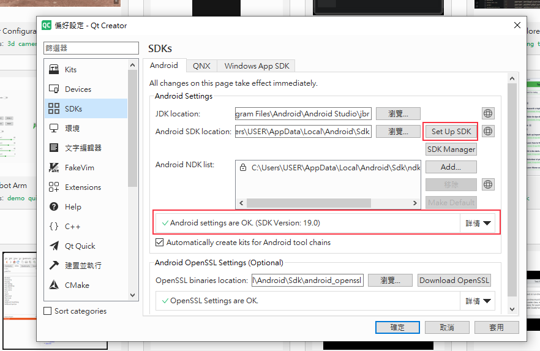
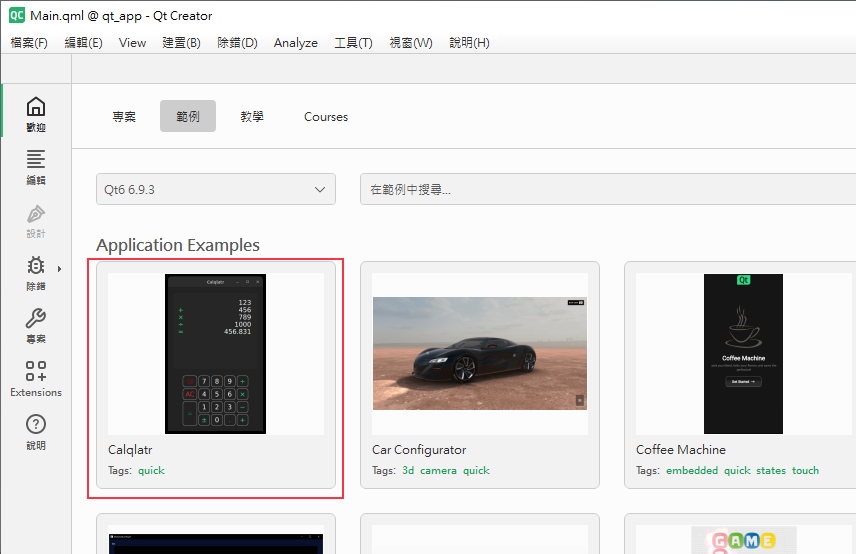
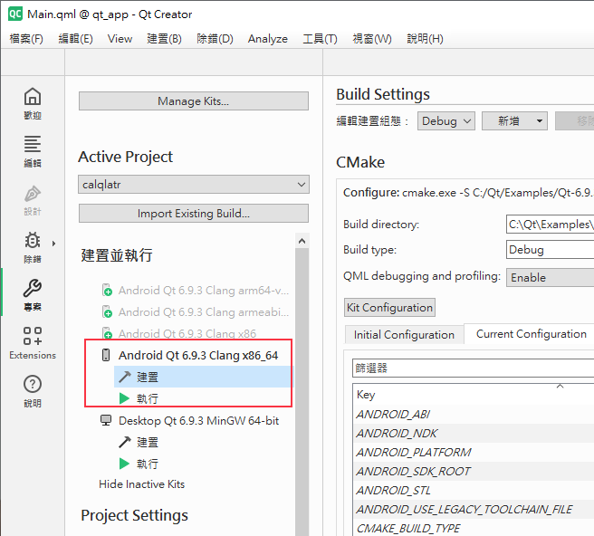
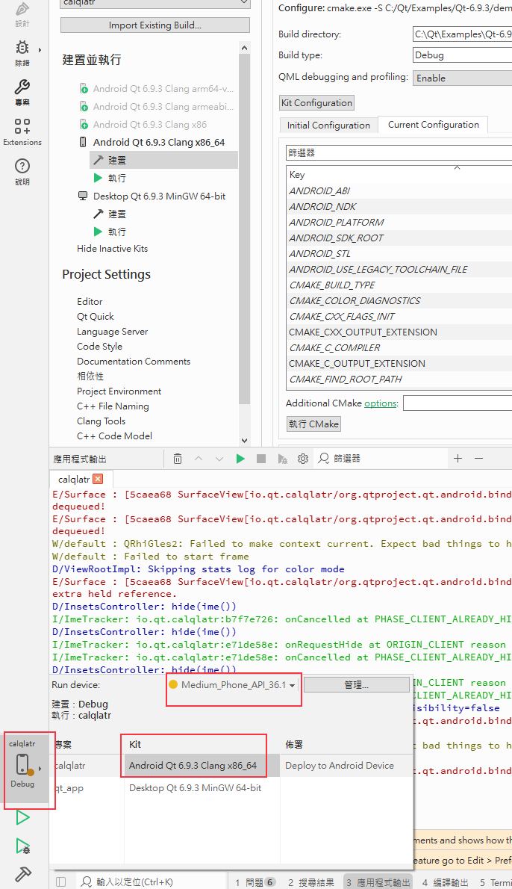
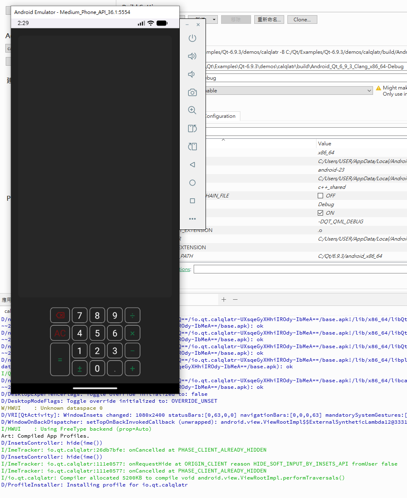

# App 開發體驗 3 - Qt

今天就來進行使用 qt framework 來開發App的部分。

## Qt 安裝

這邊使用的是 open source use 的版本，[Qt 下載點](https://www.qt.io/download-qt-installer-oss)，安裝完後，在打開 `Qt Creator` 就能看到下面的畫面

## Qt for Android

接下來這邊要先在qt裡面設定android的配置，從編輯的 `Preferences` 打開，選擇 `SDKs` ，如果 Android settings 的訊息不是 OK，我們就點 `Set Up SDK`，QT會幫我們安裝相關的配置，來讓 Android settings 變為 OK。

## Qt Run on Android

上一步做完了之後，我們透過qt的範例來測試一下，讓其跑在 android 模擬器上面，我們用 `Calqlatr` 專案來演示，點選專案

然後點選 `專案` ，會看到qt幫我們設置好 Android 相關的建置

接下來，就可以在左下角的建置選擇 Android 的建置

點擊運行的按鈕，就能成功看到 qt 的應用程序運行在 android 模擬器上了

## 結論

今天的qt體驗先到這邊，連帶著App 的開發體驗也在這邊先告一段落，再弄這些的過程，發現還是後端串數據等，我比較得心應手，前端這部分暫時提不起勁。

## 參考資料

[官方教學 - Qt for Android](https://doc.qt.io/qt-6/android-getting-started.html)
